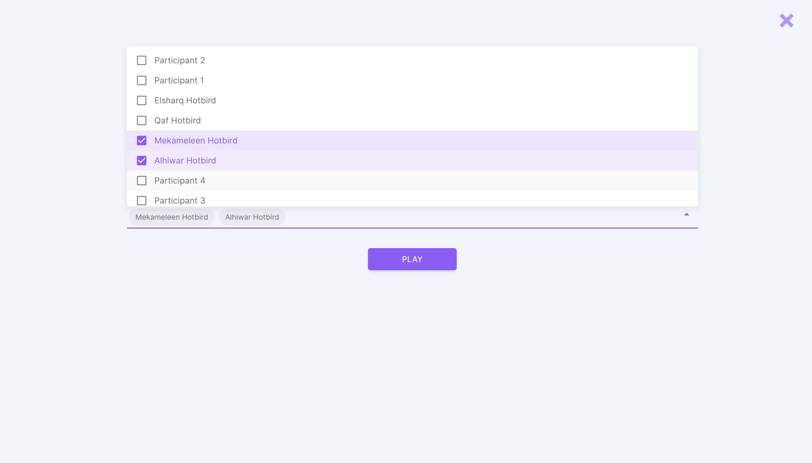
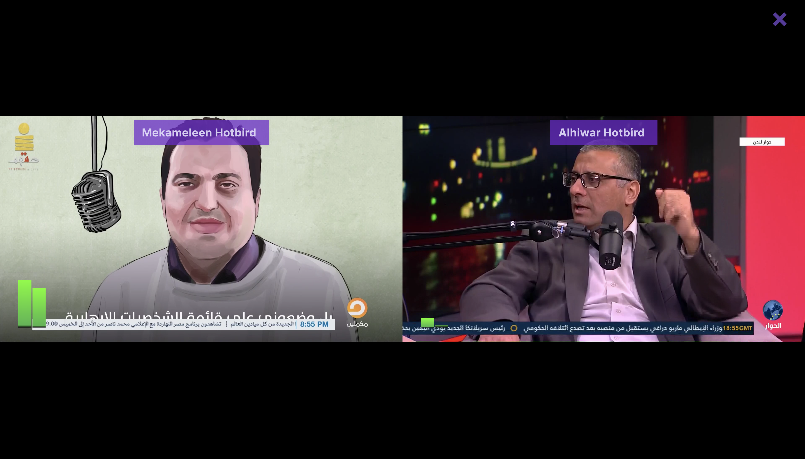

# RTM
Real Time Monitor web based tool to play back live stream in real time using Janus server.

Steps:
1-download&unzip
2-npm install
3-npm run serve
4-Visit your local version

----------------
This tool for Satellite TV channel, who has a department called MCR "Monitor Control Room". whos responsable to watch live feeds 24/7 and report any issues related with Video/Audio on each screen infront of them.
This tool aims to replace that room and those stream to be a web based tool that can be used remptely and in some causes the stream required to Mointor can be in out of range geographic areas.
This version uses free Janus server which offer 2 real-time video streams and 2 real-time audio streams for playback; acutal production server you should use your own server with your own streams: 
Some features: 
1-You can select 1 stream up to 16 streams from drop down menu, your picks will be remembered next time you use same device & browser. 
2-After Pressing play button, auto arrange your picks to fill the most area in the center of the screen in famous layouts: 1x1, 1x2, 2x2, 2x3, 3x3, 4x4,
3-On each video stream you can see an overlay box with text that show name of the stream and can be used to add meta data like bitrate ... etc.
4-Audio levels can be seen per video and they reprecent real time audio data; really short bar means low sound, high audio bar with red top means noise or really high sound.
5-Cliking on video area turn sound on/off if you need to hear the sound acutally. 
6- X on top right allow you to clear all setting and start over.
[Screenshots]

